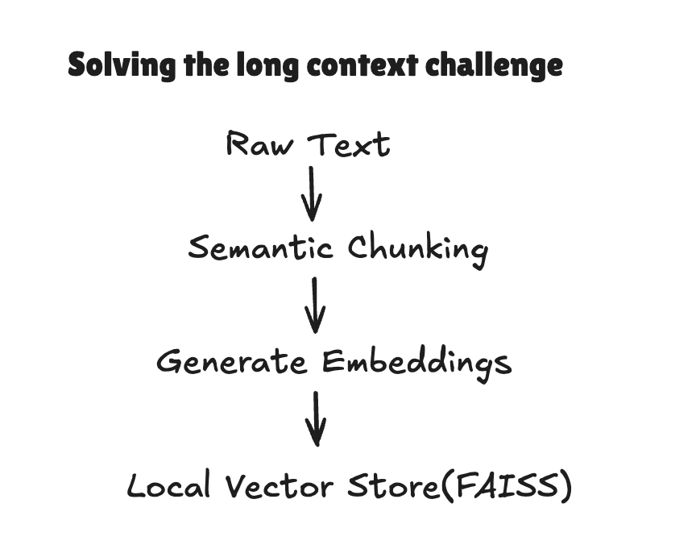

# Advanced Structured Text Parser

This project demonstrates a robust system for converting unstructured text into structured JSON, especially in cases involving:

- **Extremely long context inputs** (e.g., PDFs, email chains)
- **Deep and complex schema outputs** (e.g., 100+ nested fields, multi-level JSON)

---

## Long Context Handling

**Steps:**
1. Preprocess the raw input text into semantically meaningful chunks.
2. Generate dense embeddings for each chunk.
3. Store the embeddings in a local FAISS vector database.
4. At query time, relevant chunks are retrieved using semantic queries based on schema needs.

---

## Structured Output from Complex Schemas

Many extraction tasks require aligning the output to a very large JSON schema (sometimes thousands of fields across multiple nested layers). This system breaks down the schema and solves the problem incrementally.

**Steps:**
1. Subdivide the large schema into smaller field groups (subschemas).
2. Generate semantic queries based on each subsection.
3. Retrieve the most relevant text chunks using the vector store.
4. Use the LLM to generate structured JSON output for each subsection.
5. Validate and combine all partial outputs into a single final JSON.

---

## Live Demo

You can try a working version of this approach (focused on the complex schema challenge) here:

 [https://advanced-text-parser.streamlit.app/](https://advanced-text-parser.streamlit.app/)

 - Visit the link and try any option by uploading a file. 
 - You can upload a resume, and get in detailed structured json, etc.

> Note: Long context handling is not yet implemented in the demo version. will try to build that in future iterations as well :)
---

## Iteration Journey

Initially, the approach was to feed both the full text and entire schema to the LLM in a single prompt. This worked inconsistently, especially for deeply nested or token-heavy schemas.

After several rounds of testing, we moved toward a **divide-and-conquer** strategy:
- Break the schema into smaller, meaningful groups
- Dynamically select input context based on retrieval
- Build up partial outputs incrementally

This change significantly improved consistency, interpretability, and allowed better error handling per schema subsection.

---

## Future Improvements

- Integrate long context pipeline directly into the web app
- Auto-evaluation framework for structured output accuracy
- Human-in-the-loop field review for low-confidence outputs
